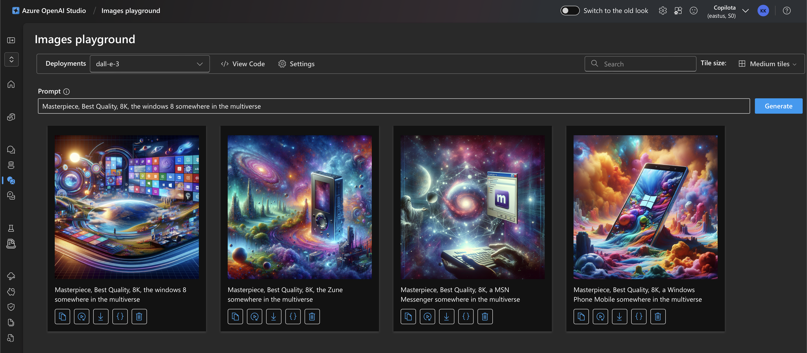
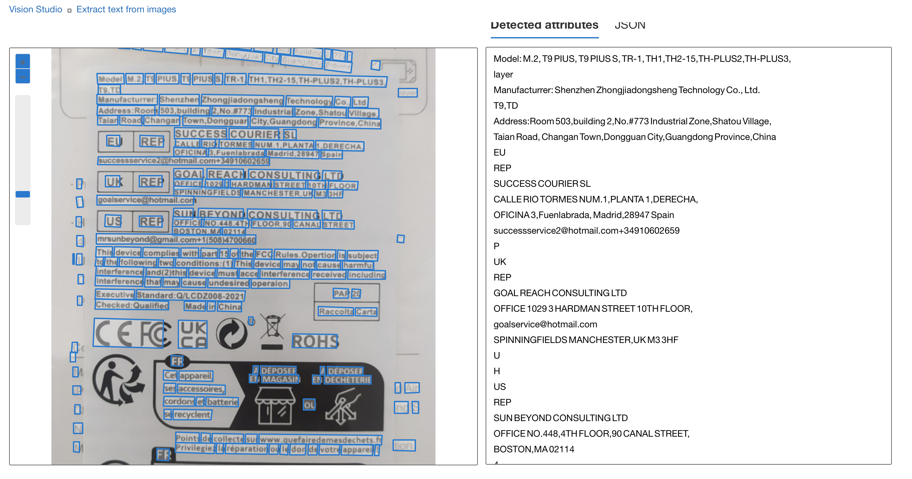

# Explorando os Recursos de IA Generativa com Azure OpenAI e Azure Vision 

Este repositório contém um projeto que utiliza o Azure OpenAI para gerar imagens e o Azure Vision para realizar reconhecimento de texto.

## Descrição do Projeto

1. **Criação do Repositório**: Foi criado repositório com o nome "copilot".
2. **Geração de Imagens**: Utilizando o Azure OpenAI, foram geradas imagens que foram salvas na pasta `inputs/`.
3. **Reconhecimento de Texto**: A imagem utilizada foi processada pelo Azure Vision para realizar o reconhecimento de texto, e os resultados foram salvos na pasta `output/`.

## Azure OpenAI

No Azure OpenAl Studio escolhi a opção Images playground e selecionei dall-e-3, utilizando palavras chaves no Prompt e depois gerando as imagens e analisando os resultados, até gera imagens satisfatórias e salvando na pasta do projeto.

## Azure Vision

No Azure Vision Studio escolhi a opção: Extrair texto de imagens e fiz o upload de uma foto de uma embalagem, e depois fez o reconhecimento do texto sem formatação e salvei no formato txt na pasta do projeto.

## Insights

- **Inteligência artificial do Azure OpenAI**: O Azure OpenAI pode ser uma ferramenta poderosa para a geração de imagens, mas existe limitações e restrições de palavras, o resultando chega a ser satisfatório até porque utiliza o dall-e-3.

- **Precisão do Azure Vision**: O reconhecimento de texto do Azure Vision e capaz de extrair qualquer palavras em imagens mesmo com texto complexo e sem ser formatando.

## Possibilidades

- **Extração de Texto com Formatação**: O Azure Vision poderia extrair o texto da imagem preservando a formatação, Isso possibilitaria que o texto extraído continuasse na estrutura original, facilitando a leitura e a compreensão.

- **Tradução do Texto Extraído**: Poderia ter um atalho no Azure Vision para depois da extração do texto formatado poderia ser enviado para o Azure Translator para traduzir o conteúdo para o idioma desejado.

- **Acessibilidade**:
A preservação da formatação pode beneficiar usuários com dificuldades de leitura, pois a estrutura visual pode ajudar na navegação e compreensão do conteúdo.

## Conclusão

Este projeto é só mais uns dos projeto sobre IA Generativa, aprendemos a utiliza o Azure OpenAI na geração de imagens e o Azure Vision no reconhecimento de texto.

